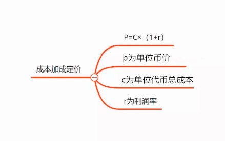

# HLC底层公链经济模型构想（方案一）

主要针对从ERC20代币向公链token的过渡构想，以及对矿工、新投资人的引入、各方利益均衡和早期生态构建

## 主要利益相关方

在构建HLC公链经济模型时需考虑矿工、基石投资人、基金会、原HLC持币者、公链早期开发团队等各方利益的均衡

1. 矿工：矿工挖矿的利益主要决定于**硬件投入成本、电费成本、区块奖励R**，矿工参与的动力大多来源于长期稳定的**有利可图**。

2. 基金会（创始团队）：基金会（创始团队）是公链的创立者，同时也是公链生态的建设者。掌控近50%的原HLC代币。可以在公链挖矿中抽税获益，基石投资资金直接掌管者。

3. 基石投资人：基石投资人直接投入资本，支持公链生态建设，获得代币凭证，享受代币增值收益。基石投资人的资金直接指向基金会，基金会是其直接关联者。从某种意义上来说，这相当于是基金会卖掉了自己手中的代币。

4. 原HLC持币者：原HLC早期支持者（ICO套牢盘）、后续市场持币散户、原hlc创始团队

5. 公链早期开发团队：作为公链早期建设贡献者，理应有一定的代币奖励。但从名义上来说，属于公链基金会给出。

鉴于2和5部分所需的代币分配可以归结于基金会名义之下，简化来看，主要考虑矿工、基金会和原hlc持有者这三大板块间的利益权衡。

在做这个权衡之前，需要先确定原HLC和公链的关系

## 原hlc和公链的关系

* 只有一条链，就是公链。本质上来说，原HLC只是一次融资行为，为了公链建设，离了公链的基础，原hlc的结构很难承载相应的商业应用，很难得到价值支撑。只能将原hlc代币看作是支持公链建设的一种凭证，公链上线，按一定配比置换新币，原ERC20代币作废。两者合并时，要降低原HLC持有者的权重（这里只是指相对整条公链而言，实际上最后在初始流通中的相对占比变化并不大）。

## HLC公链代币利益均衡

鉴于存在对原hlc凭证代币的置换需要，以及基金会需要一定的公链代币用于对早期团队的奖励以及基石资金的引入、甚至是早期生态建设的需求，毫无疑问，公链代币需要一定量的预挖。考虑到长远的矿工利益，预挖比例不宜过高，根据经济学中的**二八定理**，建议预挖比例在20%左右。当然在本模型设计中，并不对预挖比例做一个固定的精确设置，20%只作为一个上限参考。

在做各方利益权衡前，先关注下面一个信息：

* 原HLC代币分配

| 利益方  | 占 比  | 说明 |
| ------- | :----:| ------   |
| ico部分  | 50% |约30%流于市场，另20%归于基金会名下|
| 原HLC创始团队 | 20% |  -       |
| 生态建设 | 20% | 实为基金会所有 |
| 社区贡献 | 10% | 实为基金会所有 |

从上表可以看出，原hlc有近50%的未分配代币是属于基金会掌控的。

那么在做利益均衡时，首先要考虑这个“超级大户”。

* 所以我们做利益均衡的第一步，是考虑“基金会将手中的50%原hlc代币做销毁处理”，将其利益重新体现在公链上，实质上是做一个价值转移。

  这种价值转移体现在两个方面：

  * 首先，第一方面，也是基金会主要利益来源，考虑在挖矿产出的区块奖励中设定一定比例作为基金会生态建设发展基金，这是一个和矿工紧密相连的长期利益。可以看作是一种挖矿抽水。这在DCR中已有先例。
  
    *DCR区块奖励分配*
  
    | Subsidy Party |   %   |
    | :-------- | :--------: |
    | POW Miners |    60%   |
    | POS Voters |    30%   |
    | development subsidy |    10%   |
  
    作为参照，我们的区块奖励抽水比例也可以设定在10%以内这样的水平（具体数值待定）。从长远来看，基金会从这一块获取的利益是很可观的。对于将持有的50%原hlc做销毁处理，其实是值得的。
    
  * 另一方面，考虑到基石投资引入、早期开发团队奖励、以及早期生态建设这三部分的代币需求，是直接以基金会的名义给予，需要预备一个计划的相对固定的预挖比例。这个比例宜在5%-8%左右。
  
* 那么，第二步，是考虑如何让原hlc凭证代币持有者将价值转移至公链

  除去基金会手中会销毁的50%原hlc，另外有50%属于市场散户持有。这部分人的凭证置换方案我们通过设计一个 **荷兰式拍卖** 模型（公链代币的初始参考定价模型），通过市场竞价对公链代币进行估值定价，最终以一个平均置换配比 K0 作为统一的凭证置换配比（设相应的定价为P0）。参与拍卖置换的给予相应数量公链代币（暂称 DAGHLC），原hlc凭证（ERC20代币）销毁。
  
  关于荷兰式拍卖模型设计的一些细节考虑：
  * 激励设置：为鼓励原hlc持有者参与置换，可设早鸟奖励，吸引用户参与置换，减少流于二级市场的原hlc凭证代币
  * 天花板设置：即硬顶设置，参与拍卖置换的DAGHLC数量上限限制，参考值10%；相应的，有一个固定时间可参与的原hlc硬顶数量。
  * 配比下限（隐藏属性）：考虑到矿工的挖矿成本是一个最低定价参考（设为P1），尽可能的 P1 < P0。设此时对应的配比为K1，则 K1 < K0。
  * 减价参考比例设置：为荷兰式拍卖设定一个参考减价配比，这需设定一个高定价起点（可能还需要一个低定价终点限制），根据需求设定减价梯度。
  * pr配合，基金会的配合，
  * 市场估值的提升
  
* 第三步，考虑矿工的利益
  
    对于矿工利益的考虑，主要涉及到区块奖励的设计。

## DAGHLC公链代币参考定价
 
1. 根据矿工成本的定价（成本加成定价）,设为P1:
 
    
    
    由于矿机硬件寿命以及寿命期限内可挖出的代币数无法确定，挖出单位代币所需的硬件成本很难估算，此处姑且考虑矿工硬件投入已回本后的情况，即暂只考虑电费成本，则单位成本 c = Q/R，R为区块奖励，Q为挖出一个块所耗电费。

2. 利用荷兰式拍卖的市场定价：
    
    只能以原hlc代币参与DAGHLC公链代币的竞价，通过市场得出DAGHLC和原hlc的兑换比例，同时将DAGHLC定价。参与竞价的hlc直接置换新币然后销毁，未参与竞价部分按照定出的兑换比例进行映射替换.根据此兑换比例相应的给DAGHLC做了一次定价，对于基石投资也有一个参考。  
 
     目的1. 旧币换新币，比例市场定
     
     目的2. 市场给新币定价
     
     目的3. 提高市场估值，便于机构资金进来
    
