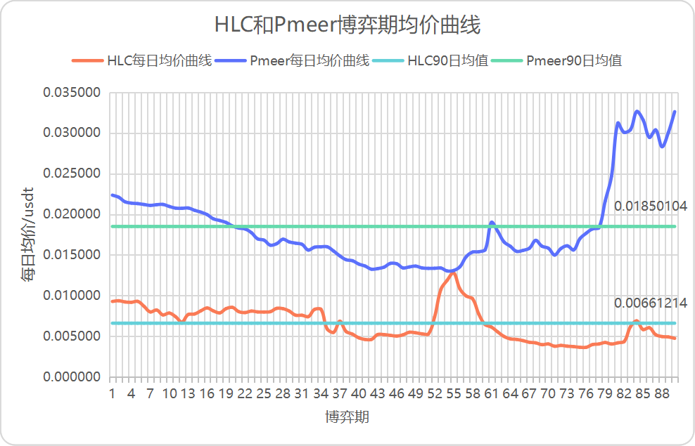

title: Qitmeer Umayyad Network 经济系统  
Status: v1.1

# Qitmeer Umayyad Network 经济系统

## 前言

Qitmeer Network 致力于打造一个公平的、服务于全球普惠金融和伦理金融的系统，来实现中正普世的金融价值观和平等开放的区块链精神。在其发展的过程中，将历经 Mecca 时期的觉醒与启蒙、Medina 时期的创新与探索，继而走向 Umayyad 时期的成熟与稳定，最终建立一个繁荣的 Abbasid 时代。

每一个时期的发展需求都所不同也无可预料，难以完全预先计划好，我们需要结合不同时期的需求和现状进行阶段性的调整。Umayyad 时期是 Qitmeer 主网正式上线的运行期，也 HLC 和 Pmeer 两个价值载体融合归一的结果，象征着 Qitmeer 网络灵魂与思想的成熟与稳定，在这个时期，将逐渐完备基础设施建设，开始建章立制，大力拓展上层生态建设，为 Abbasid 时代的繁荣奠定基础。

## 1. Qitmeer 基础代币总量

Qitmeer 主网的本币命名为 Meer，最小单位为 Qit，1Meer = 100000000 Qit。在 Umayyad 时期，Qitmeer 主网的基础代币总量定为 210240000 Meer，即 N = 2.1024亿 Meer。

## 2. 创世总量 

进入 Umayyad 时期的 Qitmeer，象征着网络正逐渐走向成熟稳定，但这完全得益于 Mecca 时期和 Medina 时期所奠定的基础。这两个时期的价值是不容忽视的，因此，在 Umayyad 网络启动时，需要首先创世产生一部分 Meer 用于继承从 Mecca 时期和 Medina 时期转移而来的价值。

Mecca 时期的代币（HLC）和 Medina 时期的代币（Pmeer）都将按照一定的比例转换成为主网代币（meer）。根据 Qitmeer Medina 网络经济模型的规则，整个 Medina 网络在 Qitmeer Network 中所占的比例为 20.0287911%，这是一个 Medina 网络初期通过民主决策得来的数值。也就是说，在 Umayyad 创世时，需要先创世出 20.0287911% 的 Meer 用于给 HLC 和 Pmeer 映射。即，用于给 HLC 和 Pmeer 兑换的 Meer 总量为：N0 = 20.0287911%×210240000 = 42108530.40864 Meer。

此外，将同时创世出 3% 作为对创始团队的激励。因此，Umayyad 时期，Qitmeer Network 的创世总量为：Ng = N0 + 3%N = 48415730.40864 Meer。

由于 HLC 和 Pmeer 存在较多废弃的尘埃账户，无需做映射，因此 Qitmeer 实际创世总量将取整为 48415730 Meer。

### 2.1. 已销毁的 HLC（B-HLC）的兑换比例

在 Qitmeer 的发展史上，Medina 时期是 Qitmeer 从区块链精神觉醒到逐渐走向成熟的重要过渡，是 Qitmeer 成为一条具有自主标准的公有链的重要过程。而 HLC Token 的销毁事件则是 Medina 网络开启的重要标志与准备，这也是 Qitmeer Network 用户进行的第一次重大的民主决策。它决定了 Medina 网络 PoW 挖矿的可产出总量上限，也决定了整个 Medina 网络在 Qitmeer Network 中所占的比重。

在这次销毁计划中，HLC 持币用户总计销毁了 200287911 枚 HLC Token，占比 20.0287911%。因此，根据 Medina 网络经济模型的规定，销毁的 HLC（B-HLC）可以优先确定映射比例，将优先分配映射创世总量的 20.0287911% 用于给销毁的 HLC 做兑换，以弥补其主动放弃流动性而为 Medina 网络做出的贡献。

因此，这 200287911 枚的 B-HLC 在 Umayyad 网络中的映射总量为 20.0287911% N0，约 8433829.59082648 Meer。相应的，单个 Token 的映射比例为 fP = 0.04210853，即一个 B-HLC 可以兑换 0.04210853 个 Meer。

### 2.2. HLC 和 Pmeer 的非同权映射——双币博弈参数 β

在 Medina 时期，由于历史的原因，Qitmeer 网络中同时存在两个 Token：HLC 和 Pmeer，它们是不同时期的价值载体，经过 Medina 时期的双币博弈后，最终都将映射成为 Umayyad 时期的 Meer。由于二者的特性差异，单个 Token 的价值并不相同，因此 HLC 和 Pmeer 属于非同权映射。

当 B-HLC（已销毁的 HLC）优先分配掉映射创世总量的 20.0287911% 后，剩余的 79.9712089% 将用于给 HLC 和 Pmeer 做映射。由于二者是非同权映射，因此他们并不是平分这 79.9712089% 的份额，而是通过自由市场的博弈来确定各自份额的大小。直观体现上便是单个 Token 的映射比例是不一样的，这二者的映射比例将受到博弈参数 β 的影响，只有当 β 等于 1 时，它们的映射比例才会相等。

参数 β 是一个自定义参数，在 Medina 网络的经济模型中，我们定义了参数 β 是单个 Pmeer 和单个 HLC 的映射权重之比。也就是说，1 个 Pmeer 的映射权重相当于是 β 个 HLC，即 1 Pmeer = β HLC。该值可以直观反应二者的价值不对等性。

在 HLC 和 Pmeer 的这场自由博弈中，参与博弈的 Pmeer 数量是 200287911，HLC 的数量是 349343287（剩余 HLC 总量是 799712089，其中 450368802 HLC 为锁仓状态不参与流通）。它们的市场份额最终决定了各自的映射权重，参数 β 的取值将直观的体现这一点。

参数 β 的取值将按照以下公式获得：

其中，u、v 分别为 HLC 和 Pmeer 的市场价格；X 为未销毁的 HLC 总量，即 7.99712089 亿；C 为锁仓的 HLC 总量，即 4.50368802 亿。故

由于任何单一时刻的市场状态均无法代表 HLC 和 Pmeer 博弈的整体水平，因此我们需要统计一个博弈阶段的市场数据求取一个平均值来确定 β 的数值。首先，我们将根据 HLC 和 Pmeer 的每日开盘价（Opening price）和收盘价（Closing price）确定当日价格均值。然后，再求取博弈数据统计期内的价格均值，从而确定出 β 的最终值。

我们统计了博弈期内90日的数据，得出最终结果：HLC 平均价格约为 0.00661214 USDT，Pmeer 平均价格约为0.01850104 USDT，β 最终值为 6.40471626。

### 2.3. HLC（未销毁的）和 Pmeer 的映射比例

HLC 和 Pmeer 分别作为 Mecca 时期和 Medina 时期的价值载体，它们共存于 Medina 时期，二者之间存在着自由的竞争博弈关系，并且在 Medina 时期结束时，将同时映射到 Umayyad 网络。由于二者属于不同的价值载体，因此不能等同视之，在进行映射分配时，二者将通过自由市场的博弈来确定分配时的权重。

根据 Qitmeer Medina 网络 Token 总数量不变的原则，Medina 网络的 Pmeer 可产出上限是由 HLC 销毁的总量确定的。在 Medina 网络启动之前，共销毁了 2.00287911亿 HLC，因此 Pmeer 的总量是 2.00287911亿，而剩余未销毁的 HLC 总量是 7.99712089亿。

在 B-HLC（已销毁的HLC）优先分配掉映射创世总量的 20.0287911% 用于映射后，剩余的 79.9712089% 将用于给 HLC 和 Pmeer 做映射，即二者兑换 Meer 的总数量为 79.9712089% N0 =  Meer。二者的映射比例将随着双币博弈参数 β 的确定而最终得以确定。

HLC 映射比例 fX 计算公式为：

即一个 HLC 可以兑换 0.01617033 个 Meer。其中，P 为已销毁的 HLC 总量，N 为 Qitmeer 主网基础代币总量。

Pmeer 映射比例 fY 计算公式为：

即一个 Pmeer 可以兑换 0.10356637 个 Meer。

## 3. 区块奖励 Block Reward 

### 3.1. 区块奖励的经济意义

选择一个区块奖励计划是一件很重要是事，但这通常多是摸着石头过河。区块奖励的一个关键属性就是它对代币总供应量的增加。一些加密货币（如，比特币及其衍生品）会根据固定的时间表减少区块奖励，并有预先确定的日期。比特币的总供应量因此受到限制。其他的（如，门罗币）始终保持着一个大于零的区块奖励率；因此代币供应是无限的。至于如何评估这两种操作方式，在实践中，总是有着不同角度的权衡取舍。

区块奖励的另一个重要属性是，在广泛的用户范围内，将网络的运营资金负担分散到所有持有代币作为价值储藏或投机目的的人身上。代币供应总量的增长使得代币的购买力会随着时间的推移而受到侵蚀，迫使所有的代币余额都产生成本。这类似于传统经济体系中众所周知的“通货膨胀税”概念。为网络贡献资源以维持网络运营和维护账本安全的人将是这些“税”的受益人，他们将以区块奖励的形式收到新铸造的代币。因此，如何定义这些受益人对网络规模的拓展与长远发展意义重大。

在 Internet 发展中，有一个著名的梅特卡夫定律，其大意是：一个网络中，用户数越多，那么整个网络和该网络内节点的价值也越大；吸引更多的人加入，形成正反馈，最终网络的价值将呈几何级数增长。同时，这一过程也使网络的使用费不断下降。这一定律从本质上揭示了网络或技术价值增加的趋势和速度，最基本的变量就是网络中节点的数量，这决定着网络被使用的程度。同样的，在区块链网络中，用户数越多，网络越庞大，共识也就越强大，该区块链网络的价值也就越大。简言之，一个区块链网络的价值和其网络中节点数量的平方成正比。

在区块链网络中，最重要的也是最基础的节点便是运行了一个完整区块链账本的全节点。全节点时刻同步着所有的区块链数据，能够独立校验区块链上的所有交易并实时更新数据，在区块链分布式账本中负责着区块链交易的广播和验证。全节点的数量直接关系着网络的安全性和共识的强度。在比特币等区块链中，矿工是主要的全节点运行者。但是在挖矿越来越趋向集中于矿池挖矿的今天，个体矿工已经不再运行一个全节点了，如果依旧将单一的矿工群体作为这些“通胀税”（以区块奖励的形式分配的新铸造的代币）的唯一受益人，将无法完全发挥出区块奖励对维护网络安全和刺激网络发展的激励作用，并且会直接影响网络的发展规模。

比特币作为区块链世界的领头羊，已经发展了十年了，近几年来，其全网算力几乎是成倍的增长，在世界范围内得到了广泛认可，但是其当前拥有的全节点数量只有约1万个（https://bitnodes.io）。而其他的区块链网络拥有的全节点数量则就更少了。这其中一个原因便是算力向矿池集中，大多数矿工已经不再运行全节点了，而矿工却是网络中唯一的被激励者。而另一个原因是，全节点没有经济激励，以致于无法满足不断增长的网络需求；运行一个全节点需要一定的经济成本，而随着区块数据的不断增长，所需的存储空间会越来越大，全节点的维护成本也将越来越高，这不仅对在区块链上建立商业应用是不友好的，而且会抑制全节点数量的增长，甚至会造成后期全节点的流失。

如果说算力是 PoW 网络的第一层防御，那么由全节点构成的生态网络便是第二层防御。Qitmeer 作为一条面向普惠金融的 PoW 底层网络，在其设计思考时，我们认为矿工不应该是区块奖励唯一的受益人。毋庸置疑，我们需要矿工提供的算力来保障账本的安全性，但是也需要有足够庞大的全节点数量来提高网络的易用性，并且希望能够激励更多人在这条网络上建立生态以扩大网络规模。我们相信，拥有足够大的全节点基数是孕育出更多生态及商业的基础。因此，对全节点进行激励将会是 Qitmeer 区块奖励的另一个重任。

### 3.2. Qitmeer 区块奖励的激励对象：矿工不仅仅是唯一的受益人

区块奖励作为区块链网络发展中最重要的激励手段，对于维持网络运营和维护账本安全有着关键作用，影响着网络的发展规模与长期稳定。在比特币等经典区块链网络中，将矿工作为区块奖励唯一的受益人，但随着矿池的出现，矿工更倾向于向矿池集中而放弃独立挖矿，因此也不再建立完整的全节点，这已远离了比特币最初的设想。但全节点却是去中心化网络的天然需求，负责实时更新数据，广播和验证交易，保存着区块链账本的完整副本。是否拥有庞大而分散的全节点网络，这是区块链实现去信任化的根本，并直接关系着去中心化网络的安全性以及用户的信任与采用。

在 Qitmeer 网络中，我们将面临着和比特币同样的难题，无法避免算力的集中化，但是如何让网络拥有庞大而分散的全节点网络是我们必须要思考的，这不仅是一个去中心化网络的基础，更是 Qitmeer 支撑普惠金融的需求与保障。因此，在 Qitmeer 系统设计中，矿工将不仅仅是区块奖励的唯一受益人，我们将为网络引入一个名为“星火节点”的角色。也就是说我们将对全节点进行经济激励，以建立起庞大而分散的全节点生态网络。

星火节点是一类运行着完整节点的特殊节点，他们将通过质押一定数量资产的方式向网络承诺实时在线服务并保证忠诚，同时，他们将获得来自区块奖励的回报。
星火节点的引入不仅能建立起庞大的全节点基数，更能促进网络生态的拓展，以及提高网络的易用性和用户的采用。所谓星星之火，可以燎原。Qitmeer对星火节点的激励，可以让开发者不用担心全节点的维护成本，甚至还可以通过星火节点获得回报，这对于在 Qitmeer 网络上建立商业应用是极为友好的。我们非常乐意见到 Qitmeer 的星星之火遍布大地，让 Qitmeer 网络的服务功能更加丰富。

未来，广大的星火节点将会演化成 Qitmeer 网络最重要的自治组织，他们是 Qitmeer 忠诚的守护者，将会是网络发展过程中最重要的影响者，乃至决策者。我们希望有更多的开发者能够采用 Qitmeer 网络来构建生态，我们也在考虑在 Qitmeer 网络建立生态财政预算，以鼓励和支持用户在 Qitmeer 网络上进行生态建设，而生态财政预算将对做出巨大贡献的节点给予支持和褒奖。

### 3.3. Qitmeer 区块奖励计划

通过前面对区块奖励的经济意义的分析，对于如何设计一个较为理想的区块奖励计划提供了一些的指导。一个精心选择的区块奖励计划应确保支付网络的长期经济可行性，包括了对用户采用、参与执行网络功能和拓展网络生态的充分激励。

在 Qitmeer 的区块奖励计划设计中，我们将 50% 的区块奖励用于对矿工的激励，作为其提供硬件设备维护网络的回报；其次，将其余 50% 的区块奖励作为星火节点质押的收益或者其他激励。

在 Umayyad 时期，Qitmeer 主网平均出块时间设定为 30 秒，每个块的初始区块奖励设定为 20 Meer。按照这样的设定，Qitmeer 的每日初始发行量约为 57600 Meer，其中 50% 用于 PoW 矿工激励，50% 用于星火节点激励以及其他激励。由于 Qitmeer 的 MeerDAG 协议支持并发出块，因此每日的实际铸币量将大于 57600 Meer。

### 3.4 Qitmeer 星火节点

#### 3.4.1 为什么要成为 Qitmeer 的星火节点？

如果我们将 PoW 共识机制视为 Qitmeer 的第一层网络，那么 Qitmeer 的星火节点则好比是建立在第一层网络之上的第二层网络。第二层网络可以孵化出更多的服务和功能，丰富 Qitmeer 的生态场景，提高其金融服务能力。第一层网络验证着新产生的区块，为整个区块链提供了动力，让其能够平稳的向前，保证网络能够提供基本的功能和保障。第二层的星火节点网络则为整个区块链提供了额外的功能，从而提高了系统的易用性，可靠性。

对于星火节点为网络提供的服务，Qitmeer Network 为其设定了奖励，在 Qitmeer 的区块奖励中，将分出一部分用来奖励星火节点。Qitmeer 星火节点以 Meer 代币作为保证金，保证自己的忠诚，作为回报，星火节点持有人凭借星火节点提供的服务将定期获得奖励。因此，成为 Qitmeer 的星火节点，可以获得一定的经济收益，能够积累更多的代币资产，可以有效抵抗代币持有的通胀损失。

#### 3.4.2 如何成为 Qitmeer 的星火节点？

想要成为 Qitmeer 的星火节点，需要满足一定的条件：

1. 一台性能尚可的电脑或服务器，并配备公网 IP，当然，你不能经常关机

   由于星火节点需要为网络提供服务，这就需要经常保持在线，离线是不能获得收益的。此外，一定的硬件配置也是需要的，但这并不会太苛刻，普通家用电脑就可以胜任。为了保证 MainNode 能够时刻和网络保持连接，配备稳定的公网 IP 是很重要的。实际上，租用一台 VPS 服务器来运行星火节点是最简单的。

2. 一定数量的 Meer 代币

   想要运行一个星火节点，你必须持有指定数量的 Meer 代币作为你对 Qitmeer Network 的忠诚度证明，并且你需要将一定数量的代币存入一个独立的地址，在运行星火节点的时候这些代币将被锁定。

3. 简单的技术知识

   想要运行一个星火节点，你需要先准备一份配置文件，在配置文件里写入必要的参数。此外，你需要掌握一点 Linux 服务器相关的操作知识，但这也只是非常简单的计算机基础知识。

#### 3.4.3 Qitmeer 星火节点奖励计划

锁定一定数量的 Meer 保证金成为 Qitmeer 的星火节点，确保稳定在线为 Qitmeer Network 提供服务，将会定期获得区块奖励。

Qitmeer Network 每产生一个新的区块，都将有 50% 的区块奖励累积到主节点奖励池，Qitmeer 的主节点系统将根据 MainNodes 的有效在线时长定期发放奖励。

由于主节点系统预计将在 Umayyad 网络上线一年后方可开发完成，因此更多细节将在后期版本中公布。

## 附件

### 附件1：[Qitmeer Umayyad 网络创世映射与释放规则](./Qitmeer_Umayyad_网络创世映射与释放规则.md)

### 附件2：[Qitmeer_Umayyad_Network_星火节点体验计划](./Qitmeer_Umayyad_Network_主节点体验计划.md)

